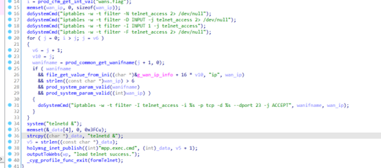
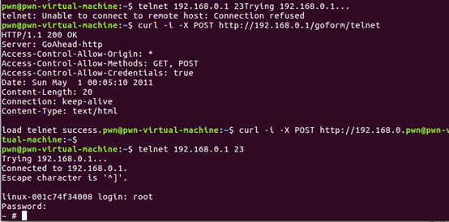

# Tenda W30E Command Execution

**Vender** ：Tenda

**Firmware version**:V16.01.0.12(4843)

**Exploit Author**: GD@hillstone

**Vendor Homepage**: https://www.tenda.com.cn/


## POC

An issue was discovered in Tenda W30E V16.01.0.12(4843) devices. An HTTP request within the handler function of the /goform/telnet  route. This could lead to  Shell Metacharacters.




When we send packets, the router will be shell

```
curl -i -X POST http://192.168.0.1/goform/telnet 
```




